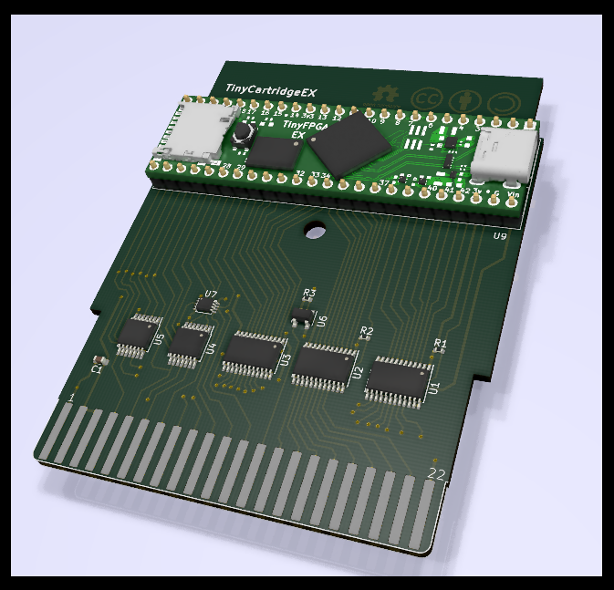

WARNING
=======

This design is completely untested.  Since the TinyFPGA EX is not
actually available yet, there are also a number of open questions
such as:

* Does the width of the module match a standard DIL-48 socket?
  - Yes it does

* Is it OK to power the module by feeding +5V into the `Vin` pin,
  and use the `3v3` pin(s) to power auxilliary logic?  (I would
  assume so, but needs to be verified.)

* Are all the 42 numbered pins capable of 3.3V I/O (I sure hope so)?

TinyCartridge EX
================

The TinyCartridge EX is a carrier board for the upcoming
[TinyFPGA EX](https://www.crowdsupply.com/tinyfpga/tinyfpga-ex)
FPGA module in the form of a Commodore 64 cartridge.  All pins
on the C64 expansion port are directly available to the FPGA, with
the modification that `IO1` and `IO2` are reduced to a single
signal with NAND, and the same for `ROML` and `ROMH`.

The intention is to provide a platform for the
[super-reu](https://github.com/zeldin/super-reu) supported by
open toolchains (i.e. SymbiFlow).

Acknowledgements
----------------

The C64 expansion port and cartridge symbol and footprint were
designed by [RETRO Innovations](http://www.go4retro.com/).

